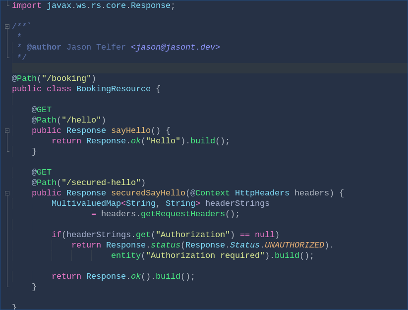

# Dracula for [Netbeans](https://netbeans.org)

> A dark theme for [Netbeans](https://netbeans.org).

## Install

All instructions can be found at [draculatheme.com/netbeans](https://draculatheme.com/netbeans).

## Supported languages

- Java
- HTML
- XML
- JavaScript

## Contribute

Netbeans supports many languages so any help adapting the theme to more languages is welcome.

## Thanks

Dracula for Netbeans is built ontop of code from the excellent [Darcula Theme](https://github.com/bulenkov/Darcula/) for Netbeans.

## Team

This theme is maintained by the following person(s) and a bunch of [awesome contributors](https://github.com/dracula/netbeans/graphs/contributors).

|  |
| ------------------------------------------------------------------------------------------ |
| [Jason Telfer](https://github.com/jasontdev)                                               |

## Community

- [Twitter](https://twitter.com/draculatheme) - Best for getting updates about themes and new stuff.
- [GitHub](https://github.com/dracula/dracula-theme/discussions) - Best for asking questions and discussing issues.
- [Discord](https://draculatheme.com/discord-invite) - Best for hanging out with the community.

## License

[MIT License](./LICENSE)
